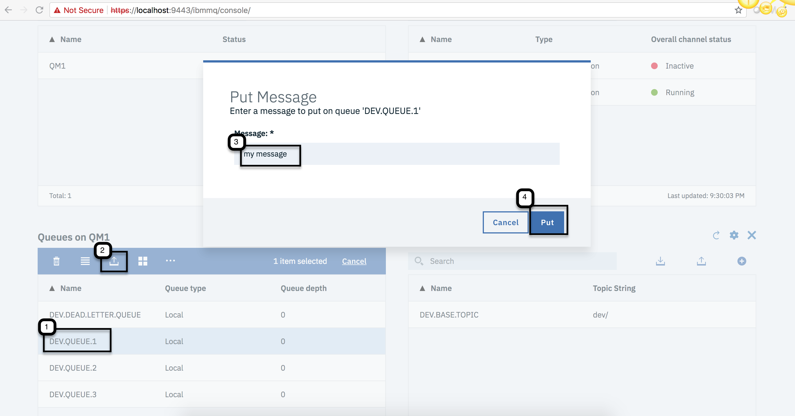
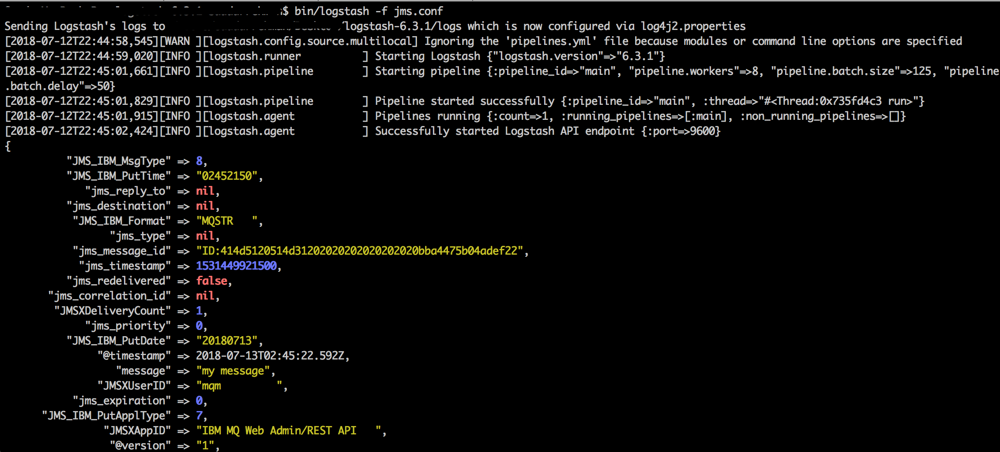

## Introduction 
This is a recipe to use Logstash JMS plugin to connect with the IBM MQ and read data.

## Step 1: Get IBM MQ Server on docker container

### Install Docker
Make sure you have docker running

### Pull MQ Server image
```
docker pull ibmcom/mq:latest
docker images
```

### Create Volume
```
docker volume create qm1data
```

### Create Network for MQ Server
```
docker network create mq-demo-network
```

### Run MQ Server Docker Container

Change the password 

```
docker run --env LICENSE=accept --env MQ_QMGR_NAME=QM1 --volume qm1data:/mnt/mqm --publish 1414:1414 --publish 9443:9443 --network mq-demo-network --network-alias qmgr --detach --env MQ_APP_PASSWORD=password ibmcom/mq:latest
```

### Test the container is running

```
$ docker ps

CONTAINER ID        IMAGE               COMMAND             CREATED             STATUS              PORTS                                            NAMES
769b9aa105c6        ibmcom/mq:latest    "runmqdevserver"    8 hours ago         Up 8 hours          0.0.0.0:1414->1414/tcp, 0.0.0.0:9443->9443/tcp   thirsty_einstein

$ docker exec -ti <your container id> /bin/bash

# Display MQ Version etc

$ dspmqver

(mq:9.0.5.0)root@769b9aa105c6:/# dspmqver
Name:        IBM MQ
Version:     9.0.5.0
Level:       p905-L180306.DE
BuildType:   IKAP - (Production)
Platform:    IBM MQ for Linux (x86-64 platform)
Mode:        64-bit
O/S:         Linux 4.9.87-linuxkit-aufs
InstName:    Installation1
InstDesc:
Primary:     Yes
InstPath:    /opt/mqm
DataPath:    /var/mqm
MaxCmdLevel: 905
LicenseType: Developer

# Display running Queue Manager
$ dspmq

(mq:9.0.5.0)root@769b9aa105c6:/# dspmq
QMNAME(QM1)                                               STATUS(Running)

$ exit

```

## Step 2: Explore MQ Console

### Login to console
https://localhost:9443/ibmmq/console

user: admin

password: passw0rd

### Add Messages to Queue
Add message to 'DEV.QUEUE.1' using UI.




## Step 4: Collect Connection Queue Details
```
Queue manager: QM1
Host name: localhost
Port: 1414
APP Channel: DEV.APP.SVRCONN
Queue: DEV.QUEUE.1
UserName: app
Password: password
```

## Step 5: Logstash JMS Connection

### Download Logstash

### Install JMS Plugin
```
bin/logstash-plugin install logstash-input-jms
```

### Fix Absolute Path in mq.yml and jms.conf file

Change jar files path in mq.yml and jms.conf file


jms.conf
```
input {
  jms {
    destination => "DEV.QUEUE.1"
    yaml_file => "CHANGE_PATH/mq.yml"
    yaml_section => "wmq"
  }
}
output {
  stdout { codec => rubydebug {}}
}
```

mq.yml
```
#

---
# IBM WebSphere MQ
wmq:
  :factory: com.ibm.mq.jms.MQQueueConnectionFactory
  :queue_manager: QM1
  :host_name: localhost
  :channel: DEV.APP.SVRCONN
  :port: 1414
  # Transport Type: com.ibm.mq.jms.JMSC::MQJMS_TP_CLIENT_MQ_TCPIP
  :transport_type: 1
  :username: app
  :password: password
  :require_jars:
    - CHANGE_PATH/jars/com.ibm.dhbcore.jar
    - CHANGE_PATH/jars/com.ibm.mq.axis2.jar
    - CHANGE_PATH/jars/com.ibm.mq.commonservices.jar
    - CHANGE_PATH/jars/com.ibm.mq.headers.jar
    - CHANGE_PATH/jars/com.ibm.mq.jar
    - CHANGE_PATH/jars/com.ibm.mq.jmqi.jar
    - CHANGE_PATH/jars/com.ibm.mq.jms.Nojndi.jar
    - CHANGE_PATH/jars/com.ibm.mq.pcf.jar
    - CHANGE_PATH/jars/com.ibm.mq.soap.jar
    - CHANGE_PATH/jars/com.ibm.mq.tools.ras.jar
    - CHANGE_PATH/jars/com.ibm.mqjms.jar
    - CHANGE_PATH/jars/javax.jms.jar
    - CHANGE_PATH/jars/javax.resource.jar
    - CHANGE_PATH/jars/javax.transaction.jar
```

### Run Logstash
```
bin/logstash -f jms.conf
```



#THE END

